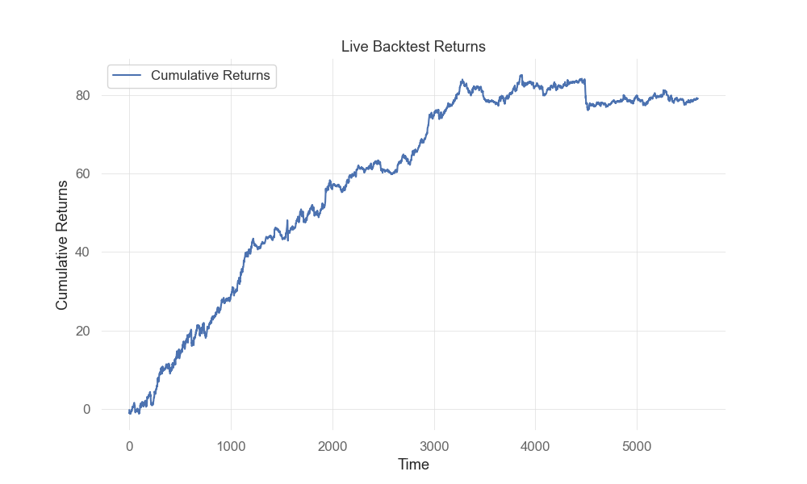

# Portfolio Optimization Framework  

This repository provides a Python-based framework for portfolio optimization and backtesting. The framework leverages advanced optimization techniques, statistical tools, and machine learning to identify the best linear combination of assets in a portfolio. 

This project has been created following the Imperial Algothon 2024 (Qube RT Portfolio problem)

## Features  

- **Bayesian Linear Portfolio Optimization:**  
  The framework identifies the optimal weights for portfolio assets based on the Sharpe ratio, adjusted by a slope/error metric for trend sensitivity.  

- **Backtesting:**  
   A backtesting simulation has been added for completion.
  
- **Scrapping:**
  The competition involved scrapping data, the framework connects to Slack to receive the password of the current dataset then fills a specific google form.


---

## Results




## Installation  

1. Clone the repository:  
   ```bash
   git clone https://github.com/EliasKha/Imperial-Hackathon-2024.git
   cd your-repository

